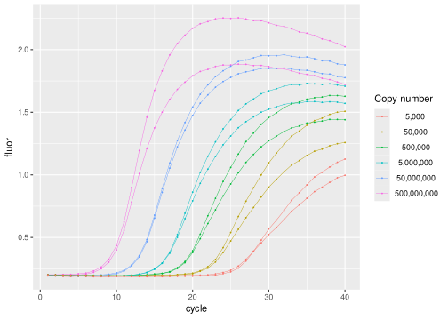

<!-- README.md is generated from README.Rmd. Please edit that file -->

# boggy

<!-- badges: start -->

[](https://CRAN.R-project.org/package=boggy)
[](https://github.com/ramiromagno/boggy/actions/workflows/R-CMD-check.yaml)
<!-- badges: end -->

`{boggy}` provides the real-time PCR data set *s1* by Boggy et
al. (2010) in tidy format.

## Installation

``` r
install.packages("boggy")
```

## Usage

``` r
library(boggy)
library(ggplot2)

s1 |>
  ggplot(mapping = aes(
    x = cycle,
    y = fluor,
    group = well,
    col = format(copies, big.mark = ",", scientific = FALSE)
  )) +
  geom_line(linewidth = 0.2) +
  geom_point(size = 0.2) +
  labs(color = "Copy number")
```



## References

Gregory J. Boggy & Peter J. Woolf. A Mechanistic Model of PCR for
Accurate Quantification of Quantitative PCR Data. PLoS ONE 5:8 (2010).
doi:
[10.1371/journal.pone.0012355](https://doi.org/10.1371/journal.pone.0012355).
